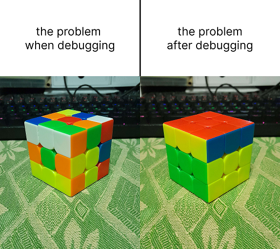

# About Me
Hello! I'm Prashanth, a Year 3 undergraduate student taking BS CS in Interactive Media and Game Design at SIT-DigiPen! It's pretty crazy to think that this is the last trimester with modules packed full of content, but here we are! I always struggle when it comes to writing about myself, but I'd say that I'm mostly a calm, collected and thoughtful individual.

## Hobbies & Interests
Aside from studying Computer Science, a couple of things I like doing are solving Rubik's cubes (working on 5x5 now!) and cycling! I also like helping out my friends when they have difficulties in completing tasks, especially when it comes to mathematics. Last but never least, I'm an avid Nintendo fan, with the Super Mario and Xenoblade series being very inspiring to me as a prospective game developer!

# Module Thoughts
I've never had any prior experience developing XR applications like some of my friends have, so I'm kind of intimidated by all the new "things" there are to consider for developing such experiences. I'm not even really sure what to make in XR that hasn't been already done elsewhere. That said, I think the technology behind all this is really interesting, so I'm glad I'm able to learn more!

## Module Outcome
I think I'd like to come out of this module having understood why XR applications are in demand by various demographics, and the ability to design smooth, seamless XR experiences. Working on my confidence to be able to take on such projects is also something I hope to improve upon.

# :parrot:
To end off, I'd like to share one of my favourite pieces of animated pixel art. :D

