# Mentimeter

Covers from Week 8 - 13

This is an attempt to collate all mentimeter questions in one MD

## Week 8
Q1\
Which interaction mechanic is commonly deemed to be the most important in immersive AR, VR and MR experiences?
- Viewport Control
- Hand Gestures
- Body (Excluding hands gestures)
- All mechanics are equally important

  
Answer

  Viewport Control

 

This is for Q2, Q3 & Q4\
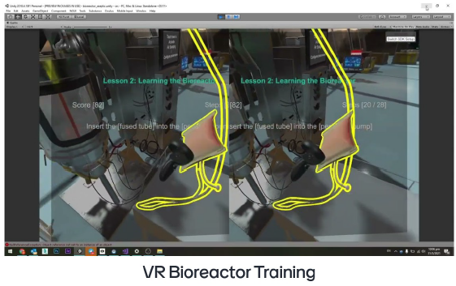

Q2\
In the VR Bioreactor Training system, what interaction mechanics were implemented?
- Viewport Control
- Hand Gestures
- Body (Excluding hands gestures)
- All of the above

  
Answer

  Viewport Control
   
  Hand Gestures

 

Q3\
In the VR Bioreactor Training system, is viewport control a passive or active interaction mechanics?
- Passive
- Active

  
Answer

  Passive

 

Q4\
In the VR Bioreactor Training system, are hand gestures a passive or active interaction mechanic?
- Passive
- Active

  
Answer

  Active

 

This is for Q5, Q6 & Q7\
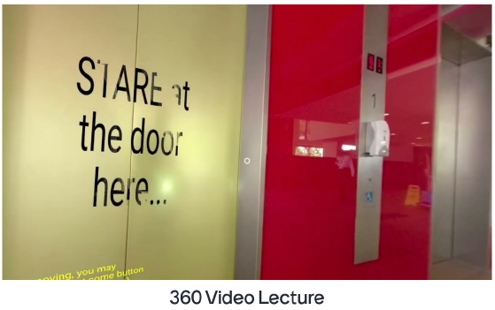

Q5\
In the 360 Video Lecture, what interaction mechanics were implemented?
- Viewport Control
- Hand Gestures
- Body (Excluding hands gestures)
- All of the above

  
Answer

  Viewport Control
   
  Hand Gestures

 

Q6\
In the 360 Video Lecture, is viewport control a passive or active interaction mechanics?
- Passive
- Active

  
Answer

  Passive
   
  Active

 

Q7\
In the 360 Video Lecture, what form of interaction authenticity is the eye-gaze point-and-click mechanic?
- Natural interaction
- Artificial magical interaction
- Artificial augmented natural interaction

  
Answer

  Artificial augmented natural interaction

 

Q8\
Many users tend to route their hands behind the virtual saw blade when asked to place their hands in the target position? What is the primary reason?
- Limited field of view in the VR headset affecting depth perception
- The saw blade simply looks hyper-realistic
- High embodiment via realistic hand representation and precise tracking
- Difficult in accurately perceiving the virtual saw blade's position

  
Answer

  High embodiment via realistic hand representation and precise tracking

 

Q9\
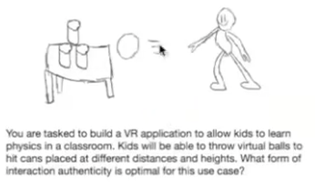\
What interaction authenticity is optimal?
- Natural interaction
- Artificial magical interaction
- Artificial augmented natural interaction

  
Answer

  Natural interaction

 

Q10\
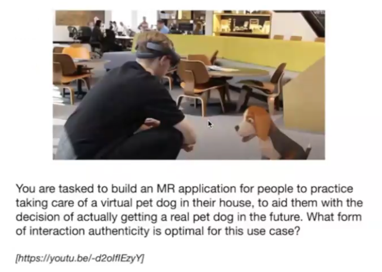\
What interaction authenticity is optimal?
- Natural interaction
- Artificial magical interaction
- Artificial augmented natural interaction

  
Answer

  Natural interaction

 

Q11\
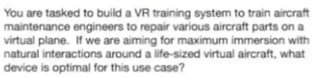\
Which device platform is the most appropriate here?
- Desktop
- Google Cardboard
- Meta Quest 2 (Wireless)
- HTC Vive Pro (Wired)
- Microsoft Hololens

  
Answer

  Meta Quest 2 (Wireless)

 

Q12\
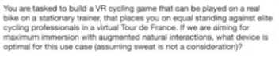\
Which device platform is the most appropriate here?
- Desktop
- Google Cardboard
- Meta Quest 2 (Wireless)
- HTC Vive Pro (Wired)
- Microsoft Hololens

  
Answer

  HTC Vive Pro (Wired)

 

Q13\
\
What form of GUI implementation is best suited for this use case?
- GUI on a virtual paper (using a virtual pen)
- GUI on a 3D plane anchored in virtual world locations
- Real-world quiz on real paper (take off HMD when interacting)

  
Answer

  GUI on a 3D plane anchored in virtual world locations
   
  Real-world quiz on real paper (take off HMD when interacting)

 

Q14\
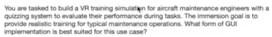\
What form of GUI implementation is best suited for this use case?
- GUI on a virtual paper (using a virtual pen)
- GUI on a 3D plane anchored in virtual world locations
- Real-world quiz on real paper (take off HMD when interacting)

  
Answer

  GUI on a 3D plane anchored in virtual world locations

 

Q15\

- Teleportation
- Joystick-based
- Walking-in-place (WIP) with KatVR 360 slidemill
- Walking-in-place (WIP) with HTC Vive HMD and trackers
- Tracking real movement in physical space

  
Answer

  Teleportation

 

Q16\
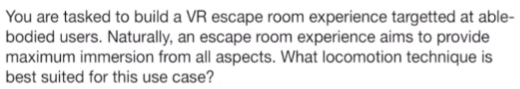
- Teleportation
- Joystick-based
- Walking-in-place (WIP) with KatVR 360 slidemill
- Walking-in-place (WIP) with HTC Vive HMD and trackers
- Tracking real movement in physical space

  
Answer

  Tracking real movement in physical space

 

Q17\
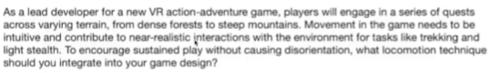
- Teleportation
- Joystick-based
- Walking-in-place (WIP) with KatVR 360 slidemill
- Walking-in-place (WIP) with HTC Vive HMD and trackers
- Tracking real movement in physical space

  
Answer

  Walking-in-place (WIP) with HTC Vive HMD and trackers

 

## Week 9
Q1\
Implement a jump action in your Babylon.js scene when the user presses the keyboard spacebar. Which trigger should you use in the ActionManager?
- OnPickTrigger
- OnInteractionEnterTrigger
- OnKeyUpTrigger
- NothingTrigger

  
Answer

  OnKeyUpTrigger

 

Q2\
\
Which implementation is the most straightforward, i.e, without reinventing the wheel?
- Behaviors
- ActionManager
- Observables

  
Answer

  ActionManager

 

Q3\
In your babylon.js, you need to periodically track changes in the position of the dog object and automatically show updates on the HUD based on its proximity to different objects.\
Which implementation is the most straightforward, i.e, without reinventing the wheel?
- Behaviors
- ActionManager
- Observables

  
Answer

  Observables

 

Q4\
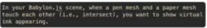\
In your babylon.js, you need to periodically track changes in the position of the dog object and automatically show updates on the HUD based on its proximity to different objects.\
Which implementation is the most straightforward, i.e, without reinventing the wheel?
- Behaviors
- ActionManager
- Observables

  
Answer

  Observables

 

Q5\
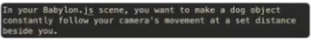\
In your babylon.js, you need to periodically track changes in the position of the dog object and automatically show updates on the HUD based on its proximity to different objects.\
Which implementation is the most straightforward, i.e, without reinventing the wheel?
- Behaviors
- ActionManager
- Observables

  
Answer

  ActionManager

 

Q6\
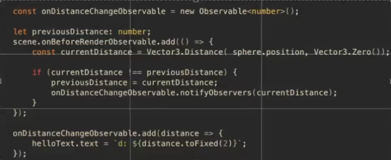\
In your babylon.js, you need to periodically track changes in the position of the dog object and automatically show updates on the HUD based on its proximity to different objects.\
Which implementation is the most straightforward, i.e, without reinventing the wheel?
- Behaviors
- ActionManager
- Observables

  
Answer

  Behaviors

 

Q7\
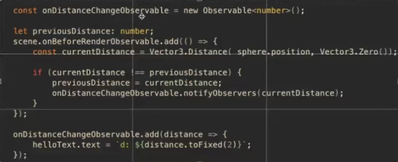\
In total, how many observers were used here?
- 0
- 1
- 2
- 3
- 4
- 5

  
Answer

  2

 

Q8\
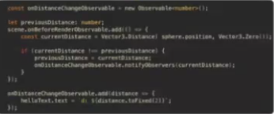\
In total, how many observers were used here?
- 0
- 1
- 2
- 3
- 4
- 5

  
Answer

  2

 

Q9\
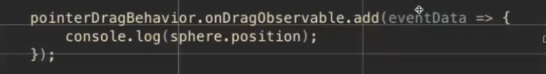\
In total, how many observers were used here?
- 0
- 1
- 2
- 3
- 4
- 5

  
Answer

  1

 

Q10\
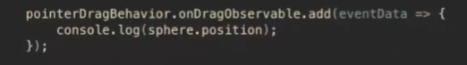\
What is the mechanics of the following code?
- It adds an Observable to pointerDragBehavior of the sphere
- It adds an Observer to the sphere
- It adds an Observer to onDragObservable of the pointerDragBehavior
- It adds and Observable to the sphere

  
Answer

  It adds an Observer to onDragObservable of the pointerDragBehavior

 

Q11\
Which API class in Babylon.js will allow you to easily add UI controls to easily manipulate the position, rotation, and scale of meshes in your scene?
- MultiPointerScaleBehavior
- GizmoManager
- PointerDragBehavior
- WebXRFeaturesManager

  
Answer

  GizmoManager

 

Q12\
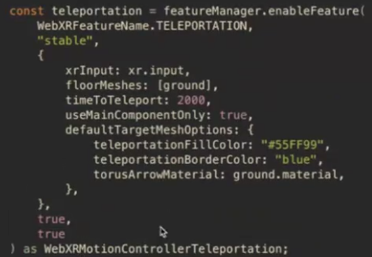\
What does ToTeleport do in the following Babylon.js code?\
- Sets the duration of the teleportation animation
- Sets the maximum time to complete the teleportation
- Sets the minimum delay between each teleportation trigger
- Sets the time in to hold the button before teleportation triggers

  
Answer

  Sets the time in to hold the button before teleportation triggers

 

## Week 10
Q1\
Which of the following describes immersion from a systems perspective?
- Wide FOV
- Higher spatial presence
- Teleportation feature
- High-fidelity graphics
- Lower cybersickness
- 6-DOF inside-out tracking

  
Answer

  Wide FOV
   
  Teleportation feature
   
  High-fidelity graphics
   
  6-DOF inside-out tracking

 

Q2\
**IMAGE REQUIRED**\
Which popular experiential construct(s) of immersion is/are relevant here?
- Flow
- Presence
- Cybersickness

  
Answer

  Flow
   
  Cybersickness

 

Q3\
Which of the following implementations will this design translate into?\
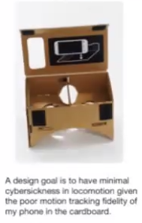
- Constrict the FOV when moving
- Test users using the VRSQ
- Test users using the IPQ
- Create a walking-in-place location feature
- Create a teleportation locomotion feature
- Create a high-fidelity realistic 3D environment

  
Answer

  Constrict the FOV when moving
   
  Create a teleportation locomotion feature

 

Q4\
What data collection methods can be appropriate here?
- Let users fill in the IPQ
- Let users fill in the VRSQ
- Let users fill in the FSS
- Perform semi-structured interviews with users
- Create telemetry tracking mechanisms to observe users

  
Answer

  Let users fill in the VRSQ
   
  Perform semi-structured interviews with users
   
  Create telemetry tracking mechanisms to observe users

 

Q5\
**IMAGE REQUIRED**\
_IIRC it's something to do with experiencing space_\
Which of the following implementations will this design translate into?
- Constrict the FOV when moving
- Test users using the VRSQ
- Create a zero-gravity arena that simulates physical weightlessness
- Create a walking-in-place location feature
- Create a teleportation locomotion feature
- Create a high-fidelity realistic 3D environment
- Create gamification features to guide users through the experience

  
Answer

  Create a zero-gravity arena that simulates physical weightlessness
   
  Create a high-fidelity realistic 3D environment

 

Q6\
**IMAGE REQUIRED**\
_IIRC it's a continuation of Q5_\
What data collection methods can be appropriate here?
- Let users fill in the IPQ
- Let users fill in the VRSQ
- Let users fill in the FSS
- Perform semi-structured interviews with users
- Create telemetry tracking mechanisms to observe users

  
Answer

  Let users fill in the IPQ
   
  Perform semi-structured interviews with users
   
  Create telemetry tracking mechanisms to observe users

 

This is for Q7 & Q8\
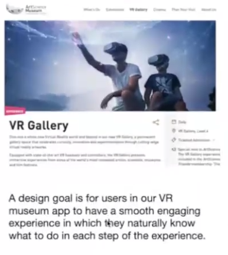

Q7\
Which of the following implementations will this design translate into?
- Create a walking-in-place location feature
- Create a teleportation locomotion feature
- Create a high-fidelity realistic 3D environment
- Create a finger-tracked hand gestures to inspect museum artifacts
- Create gamification features to guide users through the experience

  
Answer

  Create gamification features to guide users through the experience

 

Q8\
What data collection methods can be appropriate here?
- Let users fill in the IPQ
- Let users fill in the VRSQ
- Let users fill in the FSS
- Perform semi-structured interviews with users
- Create telemetry tracking mechanisms to observe users

  
Answer

  Let users fill in the FSS
   
  Perform semi-structured interviews with users
   
  Create telemetry tracking mechanisms to observe users

 

## Week 13 Summary
### Excluding Repeated Week 8 or Week 9 Questions
Q1\
Where should Strava be placed on the RV Continuum?\

- A
- B
- C
- D
- E

  
Answer

  B

 

Q2\
Why is Strava not considered to be near the "Real Environment" end of the RV spectrum?
- It has some "Extent of World Knowledge"
- It has some "Reproduction Fidelity"
- It has some "Extent of Presence Metaphor"

  
Answer

  A

 

Q3\
Which device sparked the current (21st Century) rise of VR?
- Sega VR
- Oculus Rift DK1
- Google Cardboard
- Oculus Quest
- Meta Quest 2

  
Answer

  Oculus Rift DK1

 

Q4\
The 3D models are extremly high quality. What dimension of the RV continuum is this referring to?
- Extent of World Knowledge
- Reproduction Fidelity
- Extent of Presence Metaphor
- Coherency

  
Answer

  Reproduction Fidelity

 

Q5\
The stereo optics provide a perception of depth through an LCD display. What dimension of the RV continuum is this referring to?
- Extent of World Knowledge
- Reproduction Fidelity
- Extent of Presence Metaphor
- Coherency

  
Answer

  Extent of Presence Metaphor

 

Q6\
For a moment I believed that I was actually 1000ft above ground. What dimension of the RV continuum is this referring to?
- Extent of World Knowledge
- Reproduction Fidelity
- Extent of Presence Metaphor
- Coherency

  
Answer

  Coherency

 

Q7\
Which of the following describes immersion from a systems perspective?
- Wide FOV
- Higher spatial presence
- Higher place illusion
- 8K Resolution Display
- Lower cybersickness
- 8-DOF inside out tracking

  
Answer

  Wide FOV
   
  8K Resolution Display
   
  8-DOF inside out tracking

 

Q8\
Which of the following describes immersion from an experiential perspective?
- Wide FOV
- Higher spatial presence
- Higher place illusion
- 8K Resolution Display
- Lower cybersickness
- 8-DOF inside out tracking

  
Answer

  Higher spatial presence
   
  Higher place illusion
   
  Lower cybersickness

 

Q9\
What is/are the possible famous validated questionnaires to use in the user studies, pertinent to the aims above?\
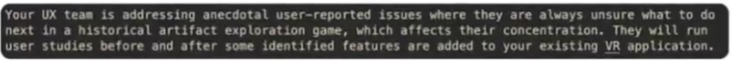
- Systems Usability Scale (SUS)
- Simulator Sickness Questionnaire (SSQ)
- Flow State Scale (FSS)
- Igroup Presence Questionnaire (IPQ)
- Virtual Reality Sickness Questionnaire (VRSQ)

  
Answer

  Flow State Scale (FSS)

 

Q10\
Which of the implementation element(s) below would improve the affordances for interactions in this app?\
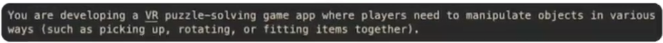
- Hand-tracking that allows natural manipulation of objects
- Having objects with clear grooves for gripping
- Haptic feedback when an object correctly fits into place
- Highlighting interactive objects with subtle glow effects
- Optimizing the frame rate and reducing latency
- Having increasing difficulty levels in the puzzles

  
Answer

  Hand-tracking that allows natural manipulation of objects
   
  Having objects with clear grooves for gripping
   
  Haptic feedback when an object correctly fits into place
   
  Highlighting interactive objects with subtle glow effects

 

Q11\
Choose the correct statement related to implementation tools.\
- Babylon.js is an open standard for web-based XR applications
- WebXR is an open-source 3D engine for web-based XR applications
- WebXR is only meant for building desktop 3D web applications
- Babylon.js can be used to build WebXR AR applications

  
Answer

  Babylon.js can be used to build WebXR AR applications

 

Q12\
What does changing the focal length of the lenses in a HMD affect?\
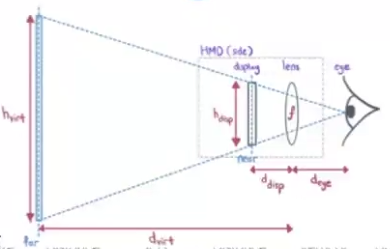
- The slope of the virtual image
- Distance between the lenses and the physical display
- IPD between the lenses
- Distance between the lenses and the user's eyes
- Vertical FOV
- Horizontal FOV

  
Answer

  The slope of the virtual image
   
  Vertical FOV
   
  Horizontal FOV

 

Q13\
Which object is easier for the user to reach out and grab with his/her hands?\
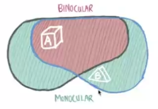
- A
- B
- Both are the same

  
Answer

  A

 

Q14\
What effect does using the same projection for both displays (or display partitiions) for both eyes in a VR HMD have?\
- Uniform perception across eyes, hence reduced cybersickness
- The field of view will be enlarged
- Reduced head tracking accurancy, increasing cybersickness
- Reduction in visual anomalies like ghosting or flickering
- None of the answers are correct

  
Answer

  None of the answers are correct

 

Q15\
What is the most optimal approach?\
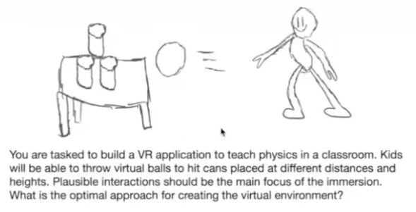
- Model-based
- Image-based

  
Answer

  Model-based

 

Q16\
What is the API class in Babylon.js that will allow you to easily use 360 images as the skybox? (Fill in the blank)

[_________]

  
Hint (Possible Answers)

  - Skybox
  - VideoDome
  - PhotoDome
  - 360Image

 

  
Answer

  PhotoDome

 

Q17\
In total, how many observables did we create?\
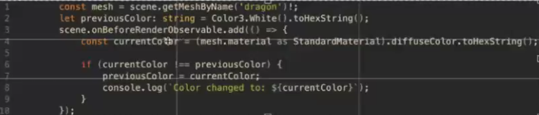
- 0
- 1
- 2
- 3
- 4
- 5

  
Answer

  0

 

Q18\
The following code allows the sphere to be dragged around...\
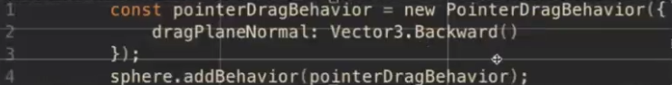
- A plane parallel to the direction the player is viewing
- A plane perpendicular to the direction the player is viewing
- In any direction
- A plane parallel to the ground

  
Answer

  A plane perpendicular to the direction the player is viewing

 

Q19\
Can you suggest an improvement to the DEBUG CODE to get the position of the sphere only when it is being dragged?\
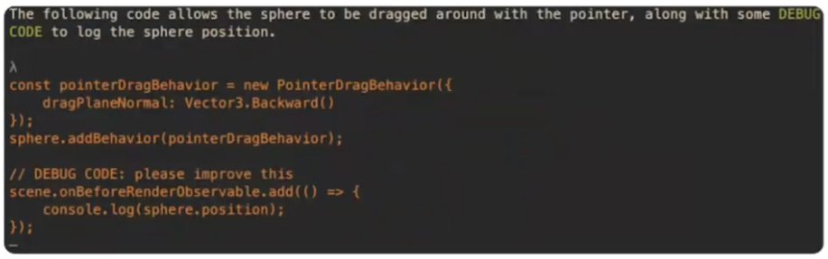
- add Observer to onDragObservable of pointerDragBehavior to get pos
- add Observer to sphere to get pos
- add Observable to sphere to get pos
- add Observer to scene to get pos

  
Answer

  add Observer to onDragObservable of pointerDragBehavior to get pos

 

Q20\
What is the order of the console logs in the following Babylon.js code? (Assume the rest of the code is correct and the scene is set up properly)\
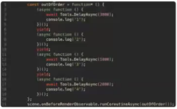
- 2,3,4,1
- 1,2,3,4
- 1,4,3,2
- 4,3,2,1

  
Answer

  2,3,4,1

 

Q21\
Which of the following element(s) enhances the experience of flow in a VR game?
- Increasing difficulty of game challenges as the player progresses
- Providing clear goals and feedback
- Improving the realism of the graphics
- Adding more AI-driven characters with human-like behaviors
- None of the answers are correct

  
Answer

  Increasing difficulty of game challenges as the player progresses
   
  Providing clear goals and feedback

 

Q22\
In our VR campus exploration game for the next release, a key focus is to reduce cybersickness. Which is/are suitable implementation approaches?\
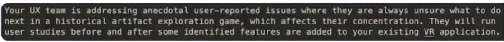
- Implement progessively challenging levels
- Implement GUI elements to present clear goals at each step
- Real-walking instead of the current joystick-based locomotion
- Reduce the FOV during movement
- Increase visual fidelity of the graphics with physically-based shaders
- Add AI-driven human characters with realistic behaviors

  
Answer

  IReal-walking instead of the current joystick-based locomotion
   
  Reduce the FOV during movement

 